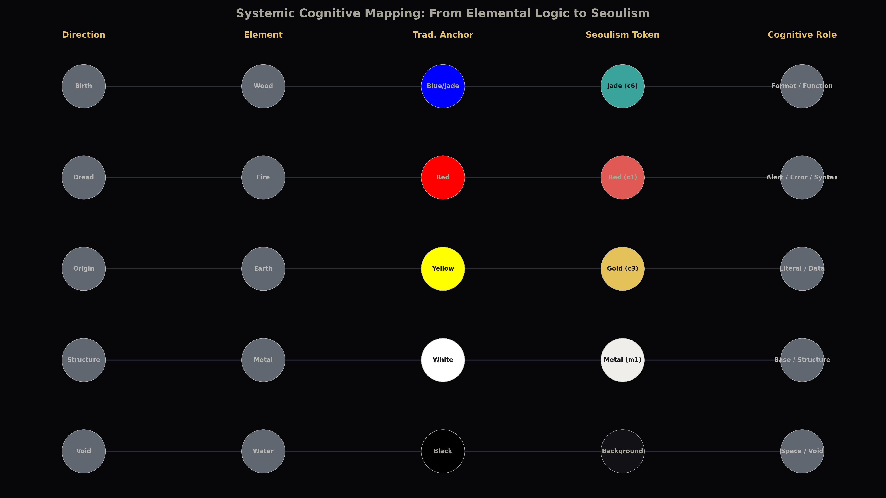
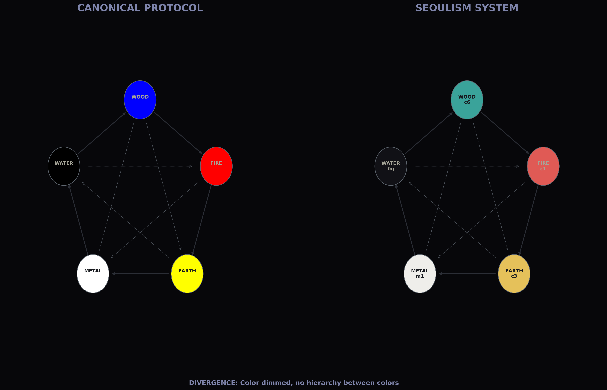
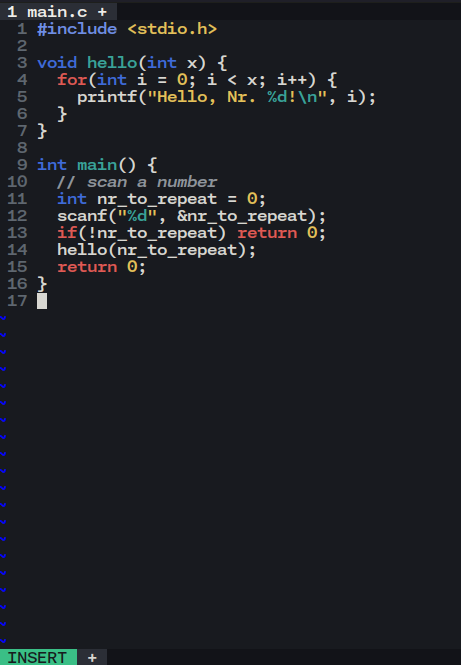

# Seoulism

A Vim and Neovim colorscheme that flips the original Seoulism palette inside out. Warm-white hanji paper becomes the background, text is rendered in pine-soot ink black, and every accent is arranged in an opposing 상극 chain.


Seoulism now translates the Korean five-color logic into a high-key UI palette where opposition drives clarity. Instead of hiding structure in the dark, every symbol has to argue for attention against an overexposed field.

Best with:

- `set termguicolors` (truecolor terminal)
- `set background=light`

---

## Quick Start

### Vim / Neovim (after installing the plugin)

```vim
set termguicolors
set background=light
colorscheme seoulism-intense
```

---

## Paper-first, flow reversed

Seoulism originally staged the code inside pine-ink darkness. The new build reverses that direction. The white field (Metal) loads first, Water (ink) draws the structure, and the chromatic accents fire back from the edges. Every highlight is now described as its counter-element.

### White paper, black ink

The canvas uses `#fdfbf5`, a slight-warm hanji tone. The default text is `#111111`, modeled after pine soot ink. Comments drift into desaturated graphite so the code line always starts as ink on paper.

### 상극: reversing the chain

Instead of marching through Fire ➜ Earth ➜ Metal, the palette now fires in reverse: **Wood → Metal**, **Fire → Water**, **Earth → Wood**, **Metal → Fire**, **Water → Earth**. Each Seoulism color now attacks the element that traditionally kept it in check. The preview diagram, visualizer, and pentagon all share this exact order so the flipped 상극 logic is impossible to miss.

### Emotion before scene

The previous "Scene first, Emotion later" principle is flipped. The ink stroke (emotion) lands first, and the scaffolding responds second. It keeps structure sharp even though the background is aggressively bright.

### Hanji glare for selection

Selections behave like burnished paper being scraped, cursor lines are beige notches, and diagnostics blast saturated colors so they are legible on top of the glare.

### Still a living system

This is still an interpretation of 오방색, just expressed as a modern daytime UI. The hierarchy is systemic, not nostalgic: a theme for people who want the same Seoul logic but need the paper-bright workspace.

---

## Reversed chain of colors




The updated diagrams document the flipped order. Each chain now starts from cognitive role ➜ Seoulism token ➜ the traditional anchor it now suppresses so you can read how each counter-color is wired.

| Step | Seoul element (color) | Traditional target | Palette effect |
| ---- | --------------------- | ------------------ | -------------- |
| 01   | **WOOD** · Jade/Indigo (`#147a72` / `#2b4cc2`) | **METAL** · Pale script (`#f7f3e8`) | Functions and links cut into the metal lattice, so structure responds after invocation. |
| 02   | **FIRE** · Vermilion (`#b0231b`) | **WATER** · Ink mass (`#111111`) | Branches and statements ignite before ink can record them, forcing Water to archive the decision late. |
| 03   | **EARTH** · Honey literal (`#c0841a`) | **WOOD** · Jade route (`#004281`) | Dense data pins the navigation layer so routes must grow around the payload. |
| 04   | **METAL** · Paper field (`#fdfbf5`) | **FIRE** · Ritual flame (`#e4252c`) | Paper glare bleaches historic warnings, so Fire over-saturates diagnostics to be seen. |
| 05   | **WATER** · Graphite (`#4c4943`) | **EARTH** · Ochre archive (`#7a4b1c`) | Documentation seeps into the earthy store so constants never calcify. |

That counter-table is the same sequence the Python visualizers render (Wood→Metal → Fire→Water → Earth→Wood → Metal→Fire → Water→Earth).

---

## What inspired the new palette

* **Hanji glare**  
  Background tones take cues from dried hanji paper illuminated at noon.
* **Pine soot ink**  
  Foreground is pure ink black; code always lands as handwriting on white.
* **Cinnabar lacquer**  
  Statements use a muted vermilion so errors punch through the bright field.
* **Indigo block printing**  
  Links and references carry a deep blue taken from textile prints.
* **Burnished brass**  
  Constants lean on honeyed brass to prevent the canvas from washing out.
* **Chalked highlights**  
  Selection and command surfaces mimic chalk dust over paper.

---

## Install

### Vim-plug (Vim / Neovim)

```vim
call plug#begin()
Plug 'gg582/seoulism-intense.vim'
call plug#end()

set termguicolors
set background=light
colorscheme seoulism-intense
```

### Vundle (Vim)

```vim
set nocompatible
filetype off
set rtp+=~/.vim/bundle/Vundle.vim
call vundle#begin()

Plugin 'VundleVim/Vundle.vim'
Plugin 'gg582/seoulism.vim'

call vundle#end()
filetype plugin indent on

set termguicolors
set background=light
colorscheme seoulism-intense
```

Then run:

* `:PluginInstall`

### Native package install (Vim 8+)

```sh
git clone https://github.com/gg582/seoulism.vim.git ~/.vim/pack/seoulism/start/seoulism
```

Then in your vimrc:

```vim
set termguicolors
set background=light
colorscheme seoulism-intense
```

### Manual

* Vim: `~/.vim/colors/seoulism-intense.vim`
* Neovim: `~/.config/nvim/colors/seoulism-intense.vim`

```vim
set termguicolors
set background=light
colorscheme seoulism-intense
```

---

## Code Tendency Checker

The optional tendency checker stays exactly the same. Only the palette flipped; the structural analysis of your buffer still maps code tendencies back to the five directions.

### Commands

```vim
:wopp                 " turn on the tendency checker
" let g:seoulism_warn_opp = 0 to disable auto-check
:noopp                " turn off the tendency checker
:warncfg <0-100>      " set the sensitivity (percent)
```

### How `:warncfg` works

* `:warncfg {0-100}` sets the minimum strength (in percent) required for a tendency to be reported.
* **Higher values suppress more output** (stricter filter; less sensitive).
* **Lower values show more output** (looser filter; more sensitive).
* If your file mixes multiple roles heavily, weaker signals may be filtered out depending on this setting.

A practical starting point:

* `:warncfg 10`  show more (loose)
* `:warncfg 30`  balanced
* `:warncfg 60`  show less (strict)

---

### Code Tendency Mapping

| Dominance        | Core Tendency           | Structural Context                                                               |
| ---------------- | ----------------------- | -------------------------------------------------------------------------------- |
| **WOOD** (Jade)  | **Declarative Birth**   | **Header files**, interface contracts, function prototypes, and API definitions  |
| **FIRE** (Red)   | **Operational Heat**    | **Control flow**, main loops, exception handling, and dynamic execution          |
| **EARTH** (Gold) | **Stable Root**         | **Config tables**, constant mappings, hardcoded literals, and resource datasets  |
| **METAL** (Base) | **Structural Rigidity** | **Type definitions**, static schemas, system boilerplate, and memory allocations |
| **WATER** (Void) | **Implicit Space**      | **Documentation blocks**, extensive comments, delimiters, and metadata           |

---

### Dynamic Balance Tendency

| Dominant Interaction | Code Personality                                                                 |
| -------------------- | -------------------------------------------------------------------------------- |
| **WOOD ➔ EARTH**     | **Pure Abstraction**: Focuses on defining high-level interfaces over raw data    |
| **EARTH ➔ WATER**    | **Data Concentration**: Optimized for dense storage and literal-heavy structure  |
| **WATER ➔ FIRE**     | **Contextual Clarity**: Prioritizes documentation and human-readable explanation |
| **FIRE ➔ METAL**     | **Logic Agility**: Prioritizes branching execution and dynamic algorithmic flow  |
| **METAL ➔ WOOD**     | **Architectural Integrity**: Focuses on type safety and rigid system boundaries  |

---

## Palette



---

## Notes

* A truecolor terminal is strongly recommended.
* Light-mode terminals should still set `background=light` for consistent highlights.

---

## License

See `LICENSE` (or the repository license file).
